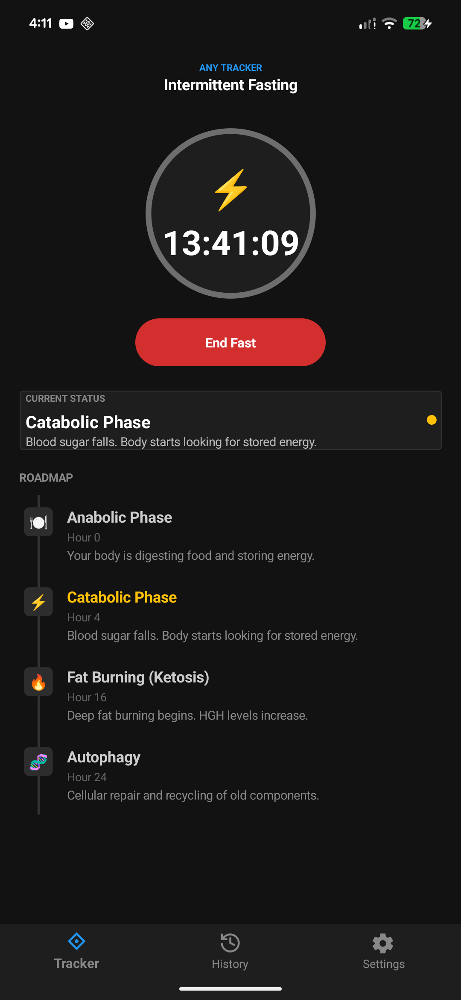

# ⏳ OpenTracker

  

**OpenTracker** is a highly configurable, open-source tracker app built with **.NET MAUI**. It empowers users to track any time-based process—from intermittent fasting and Pomodoro timers to pregnancy milestones—simply by switching configurations.

The app uses a flexible JSON-based architecture, allowing for infinite extensibility without changing the source code.

## 📸 Application Pictures

| Home Screen                                                                          | History & Analytics                                                                     | Settings                                                                                          |
|--------------------------------------------------------------------------------------|-----------------------------------------------------------------------------------------|---------------------------------------------------------------------------------------------------|
|  |  |  |
| *Track active progress with visual stages*                                           | *View weekly charts and past sessions*                                                  | *Switch configurations instantly*                                                                 |

---

## ✨ Key Features

* **📄 Flexible Configuration:** Trackers are defined entirely by JSON files located in `OpenTracker/Resources/Raw`.
* **💾 Local Persistence:** Built-in **LiteDB** integration ensures your tracking history and active sessions are saved locally and persist across app restarts.
* **📊 History & Insights:** View your tracking history with a weekly activity chart and detailed session logs.
* **🔄 Multi-Stage Tracking:** Support for complex processes with multiple stages (e.g., Fasting zones, Pregnancy trimesters), complete with custom colors and icons.
* **✏️ Manual Adjustments:** Forgot to start the timer? Use the **Manual Entry** feature to backdate your start time or adjust ongoing sessions.
* **🔔 Sticky Notifications:** (Android) Persistent notifications keep you updated on your current stage and elapsed time without opening the app.


---

## 🚀 Quick Start

### 🧰 Requirements

1. **.NET 10.0 SDK** (or compatible MAUI workload).
2. **IDE:** JetBrains Rider, Visual Studio 2022, or VS Code with C# Dev Kit.
3. **Toolchains:** Platform-specific dependencies (Android SDK, Xcode, etc.) if targeting mobile.

### 🏃 Open and Run

1. **Clone:** Clone the repository to your local machine.
2. **Open:** Load `OpenTracker.sln` in your preferred IDE.
3. **Restore:** Run `dotnet restore` in the terminal.
4. **Build & Run:** Select your target platform (Android/iOS/Windows/MacCatalyst) and run the application.

---

## 📂 Project Layout

| Directory | Description |
| --- | --- |
| **`OpenTracker`** | The core MAUI app project |
| **`OpenTracker/Pages`** | UI pages (e.g., `MainPage.xaml`, `HistoryPage.xaml`, `SettingsPage.xaml`) |
| **`OpenTracker/ViewModels`** | MVVM Logic (`MainViewModel`, `HistoryViewModel`) |
| **`OpenTracker/Services`** | Logic for Database (`LiteDbService`) and Notifications |
| **`OpenTracker/Resources/Raw`** | JSON configuration files (`config_*.json`) and manifest |

---

## ⚙️ Configuration & Customization

OpenTracker is data-driven. You can add new tracking modes without writing C# code.

### The Manifest (`tracker_manifest.json`)

This file registers available trackers in the app.

```json
[
  {
    "Name": "Intermittent Fasting",
    "FileName": "config_fasting.json",
    "Icon": "🍽️"
  }
]

```

### 🛠️ How to Add a New Tracker

1. **Create:** Add a new JSON config file in `OpenTracker/Resources/Raw` (e.g., `config_study.json`).
2. **Define:** Set the `TrackerName`, `DisplayFormat` (Time/Days/Weeks), and `Stages`.
3. **Register:** Add an entry to `tracker_manifest.json` referencing your new file.
4. **Reload:** The app will automatically seed the new configuration into the database on the next launch.

---

## 🧠 Under the Hood

* **State Management:** Uses `Preferences` for lightweight state (isTracking, startTime) and `LiteDB` for relational data (session history).
* **Architecture:** Follows the MVVM pattern with data binding in XAML.
* **Notifications:** Uses platform-specific services (e.g., `AndroidNotificationService`) injected via dependency injection.

---

## 🗺️ Roadmap

* [x] 💾 **Persistence:** SQLite/LiteDB integration for history.
* [x] 🐧 **Platform Support:** Android
* [ ] 🐧 **Platform Support:** Windows
* [ ] 🐧 **Platform Support:** MacOS
* [ ] 🐧 **Platform Support:** iOS
* [ ] 🌍 **Localization:** Add support for translating tracker definitions and UI.
* [ ] ☁️ **Cloud Sync:** Backup and sync history across devices.
* [ ] ✏️ **In-App Editor:** UI for creating and editing tracker JSON files directly in the app.
* [ ] 📦 **Export Data:** Export history to CSV or JSON.

---

## 🤝 Contributing


Contributions are welcome!

1. Fork the repository.
2. Create a feature branch (`git checkout -b feature/AmazingFeature`).
3. Commit your changes (`git commit -m 'Add some AmazingFeature'`).
4. Push to the branch (`git push origin feature/AmazingFeature`).
5. Open a Pull Request.

---

### 📄 License

Distributed under the MIT License. See `LICENSE` for more information.
